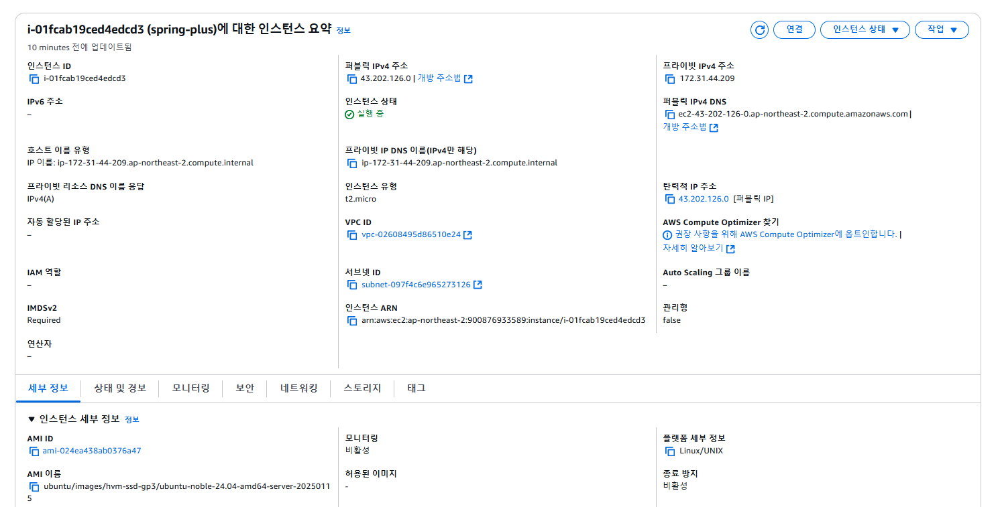

---

# Spring Plus

플러스 주차 개인과제 레포지토리입니다. 다음과 같은 내용을 공부하고 적용해보았습니다.

1번 과제 : @transactional(readOnly = true) 공부

2번 과제 : JWT에 nickname 정보 추가하기

3번 과제 : JPA의 이해(조건을 적용한 페이지네이션)

4번 과제 : 컨트롤러 테스트 코드 수정

5번 과제 : Logging AOP 코드 수정

6번 과제 : JPA의 cascade 속성

7번 과제 : N+1 문제 해결하기

8번 과제 : QueryDSL 적용하기

9번 과제 : Spring security 적용 + 테스트에서 뚫기

10번 과제 : QueryDSL 검색기능 만들기 (if-else이용했다가 Boolean Expression으로 바꾸었습니다.)

11번 과제 : Transactional 심화

12-1, 12-2번 과제 : EC2, RDS 연결

12-3번 과제 : 유저 프로필 이미지 업로드 구현 + S3

13번 과제 : 인덱스를 이용해서 대용량 데이터 처리


## Health Check API


아래 링크에 접속하세요.

https://fromyubin.com/auth/healthcheck

백그라운드 실행을 통해 EC2 서버와 연결이 끊기더라도 스프링 서버가 실행가능하도록 했습니다.

```bash
nohup java -jar build/libs/expert-0.0.1-SNAPSHOT.jar &
```


## AWS 설정 스크린샷

EC2 설정


EC2 보안그룹


Elastic IP


Load Balancer 설정


Load Balancer 보안그룹


RDS 설정


RDS 보안그룹


Route 53 설정


S3 설정


## 13번 과제 대용량 데이터 처리 비교 이미지


1. **100만 건 데이터 생성**: JDBC Template의 batchUpdate()를 이용해서 생성했습니다. (RDS가 아닌 로컬 DB에 생성했습니다.)


2. **Full Scan 속도 측정**:

   


3. **인덱스 테이블 생성**: 다음 명령어로 인덱스 테이블을 생성했습니다.

   ```bash
   CREATE INDEX idx_users_nickname ON users (nickname);
   ```
   

4. **인덱스를 적용한 속도 측정(Indexed Scan)** :

   


5. **Response Time 비교** :


    20명의 사용자가 각각 20번 요청을 수행하도록 설정했습니다. (jmeter를 이용했습니다)

    Full Scan에서는 400번의 요청이 모두 끝나지 않았음에도 불구하고 최대 Response Time이 10713ms로 측정되었습니다.

    반면, Indexed Scan에서는 단시간 내에 요청이 모두 끝났으며 최대 Response Time이 667ms로 측정되었습니다.


---

